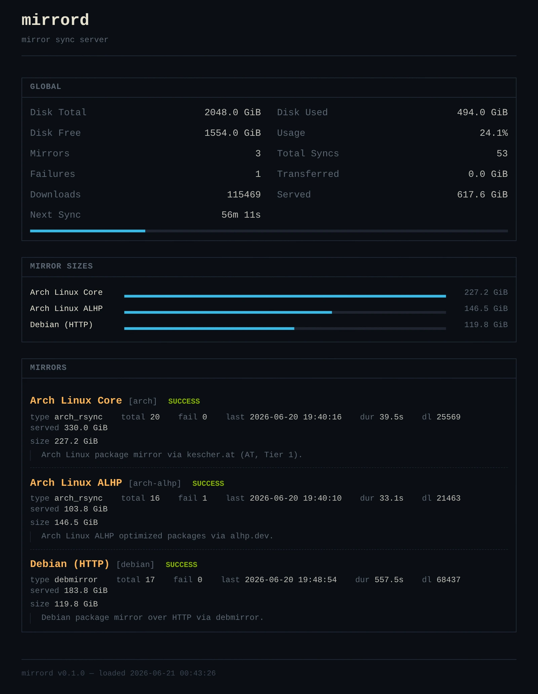

# mirrord

[](https://github.com/nemvince/mirrord/actions/workflows/docker-publish.yml)
[](https://github.com/nemvince/mirrord/commits/main)
[](https://github.com/nemvince/mirrord/stargazers)


Mirror sync server with a pluggable backend — schedule and trigger rsync-based
package/repository mirrors, browse them through a web UI, and control everything
over a Unix socket.



## Quick start

```bash
# install deps & run (requires mise or manually installed python + uv + bun)
mise install
uv sync
bun install
bun tailwindcss -i app/static/tailwind.css -o app/static/output.css --minify

# create your config
cp config.example.yaml config.yaml

# start the server
uv run python -m app.main
```

Or with mise tasks:

```bash
mise run css:watch  # tailwind CLI for CSS
mise run dev        # uvicorn --reload on :8080
mise run build      # Docker build
```

```
# CLI (while server is running)
uv run python -m app.cli status
uv run python -m app.cli trigger arch
uv run python -m app.cli stop arch
```

## Configuration

`config.yaml` (override path with `MIRRORD_CONFIG`):

```yaml
server:
  host: "0.0.0.0"
  port: 8080

sync:
  interval: 3600          # seconds between scheduled syncs
  lock_dir: "/tmp/mirrord" # lock-file directory

plugins:
  - type: arch_rsync
    enabled: true
    name: "Arch Linux Core"
    slug: "arch"
    config:
      target: "/data/archlinux"
      source_url: "rsync://rsync.archlinux.org/ftp_tier1"
      lastupdate_url: "https://rsync.archlinux.org/lastupdate"
      tls: true
      bwlimit: 0           # KiB/s, 0 = unlimited
      excludes:
        - "*.links.tar.gz*"
        - "/other"
        - "/sources"
```

## Environment variables

| Variable | Default | Description |
|---|---|---|
| `MIRRORD_CONFIG` | `config.yaml` | Config file path |
| `MIRRORD_SOCKET` | `/tmp/mirrord/control.sock` | Control socket path |
| `MIRRORD_LOG_LEVEL` | `INFO` | Log level (`DEBUG`, `INFO`, `WARNING`, `ERROR`, `CRITICAL`) |
| `MIRRORD_GEOIP_DB` | _(auto-detect)_ | Path to a GeoLite2 Country `.mmdb` database (see [GeoIP](#geoip)) |

## API

### Web UI

| Route | Description |
|---|---|
| `GET /` | Dashboard — sync status, disk usage, plugin overview |
| `GET /{slug}/` | Browse mirror directory tree |
| `GET /{slug}/{path}` | Browse a subdirectory |

### JSON API

| Route | Description |
|---|---|
| `GET /api/stats` | All plugin stats (status, timings, totals) |
| `GET /api/browse/{plugin}?q={path}` | List directory entries as JSON |

### Control socket

JSON-over-Unix-socket for headless automation. CLI wrapper: `app/cli.py`.

| Action | Payload | Description |
|---|---|---|
| `status` | `{"action":"status"}` | Full plugin stats |
| `trigger` | `{"action":"trigger","plugin":"arch"}` | Trigger a sync (omit `plugin` for all) |
| `stop` | `{"action":"stop","plugin":"arch"}` | Stop a running sync (omit for all) |

## Plugins

Plugins implement `BaseSyncPlugin` (`app/plugins/base.py`). Register new types in
`app/plugins/registry.py`.

### Built-in: `arch_rsync`

Rsyncs Arch Linux package repos from a Tier‑1 upstream. Compares the
`lastupdate` file before each sync — skips if unchanged. Supports TLS
(via `rsync-ssl`), bandwidth limits, and exclude patterns.

## Docker

```bash
docker build -t mirrord .
docker run -d -p 8080:8080 -v /srv/mirrors:/data -v ./config.yaml:/app/config.yaml mirrord
```

## GeoIP

Download stats can be broken down by country. This requires a MaxMind
[GeoLite2 Country](https://dev.maxmind.com/geoip/geolite2-free-geolocation-data)
`.mmdb` database, which is **not** bundled in the image (it needs a free MaxMind
license to download). Without one, geolocation is silently disabled and
everything else works normally.

At startup mirrord looks for the database in these locations, in order:

1. The path given by `MIRRORD_GEOIP_DB` (if set)
2. `/usr/share/GeoIP/GeoLite2-Country.mmdb`
3. `/var/lib/GeoIP/GeoLite2-Country.mmdb`
4. `/usr/local/share/GeoIP/GeoLite2-Country.mmdb`

To enable it, mount your `.mmdb` file into the container. Either drop it in one
of the default paths:

```bash
docker run -d -p 8080:8080 \
  -v /srv/mirrors:/data \
  -v ./config.yaml:/app/config.yaml \
  -v /path/to/GeoLite2-Country.mmdb:/usr/share/GeoIP/GeoLite2-Country.mmdb:ro \
  mirrord
```

…or mount it anywhere and point `MIRRORD_GEOIP_DB` at it:

```bash
docker run -d -p 8080:8080 \
  -v /srv/mirrors:/data \
  -v ./config.yaml:/app/config.yaml \
  -v /path/to/geoip:/data/geoip:ro \
  -e MIRRORD_GEOIP_DB=/data/geoip/GeoLite2-Country.mmdb \
  mirrord
```

To confirm the database was picked up, start with `MIRRORD_LOG_LEVEL=DEBUG` and
look for the `mirrord.geo` log lines (`GeoIP loaded: …` vs. `No GeoIP database
found`).
